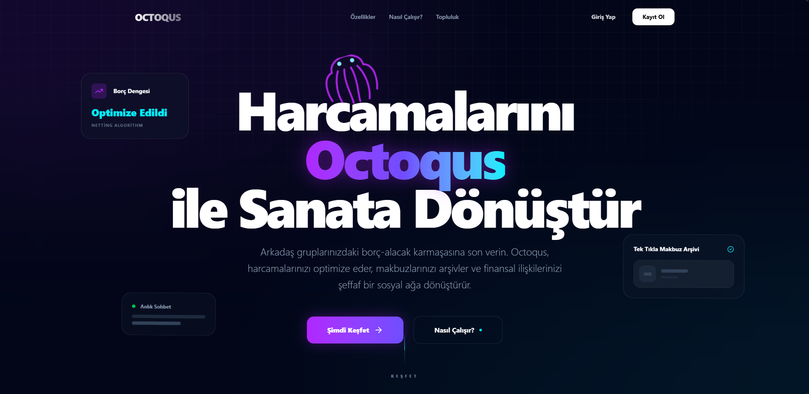
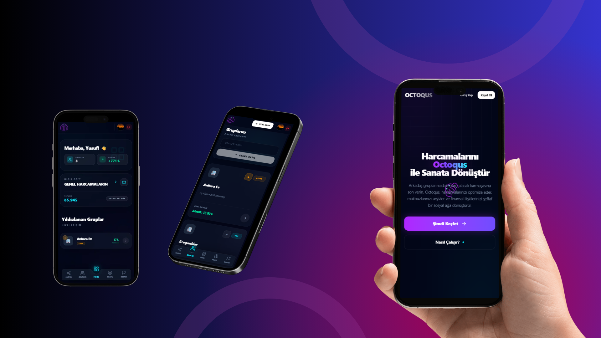
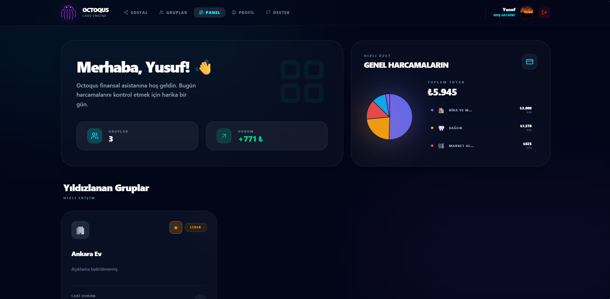
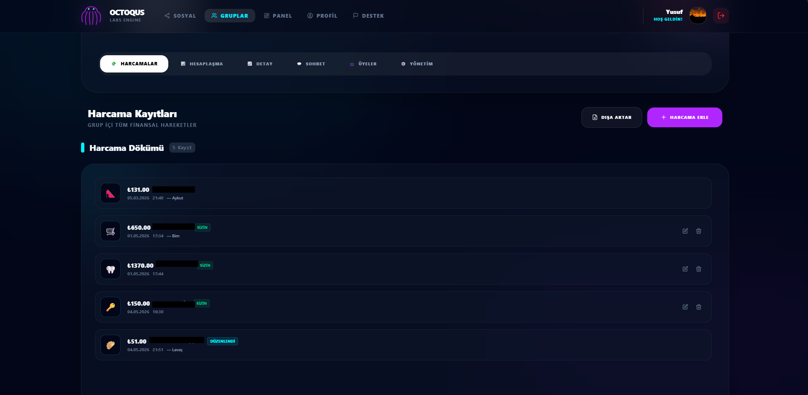
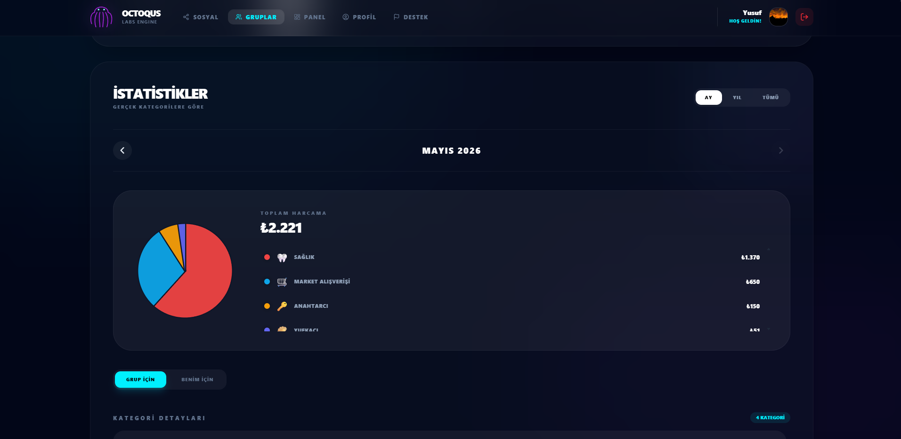

# 🎯 Octoqus - Expense Tracking & Social Finance Platform

<div align="center">
  

  <br/><br/>

  
  
  
  
  
  
  
  
  
  
  

</div>

> A modern **production-ready full-stack web application** for expense management and social financial collaboration.

---

## 📑 Table of Contents

- [Overview](#-overview)
- [Technical Architecture](#️-technical-architecture)
- [Key Features](#-key-features)
- [Application Screenshots](#-application-screenshots)
- [Installation & Setup](#-installation--setup)
- [Security Features](#-security-features)
- [Database Schema](#-database-schema)
- [Performance & Scalability](#-performance--scalability)
- [Developer Notes](#-developer-notes)
- [API Endpoint Examples](#-api-endpoint-examples)
- [Project Stats](#-project-stats)
- [License](#-license)
- [Contact](#-contact)

---

## 📋 Overview

**OctoqusLive** is a full-stack web application that enables users to track personal expenses, manage group-based spending, and share financial topics in a social-network-like environment. The platform is built with modern web technologies and features a **production-grade** architecture with enterprise-level security standards.

**Production URL:** https://octoqus.com

<div align="center">
  
</div>

---

## 🏗️ Technical Architecture

### Tech Stack

| Component | Technology |
|-----------|-----------|
| **Frontend** | React 19 + TypeScript + Vite |
| **Styling** | Tailwind CSS 4 + Framer Motion (Animations) |
| **State Management** | Zustand (Lightweight + Reactive) |
| **Validation** | Zod + React Hook Form |
| **Testing** | Vitest + Playwright (E2E) |
| **Backend** | Python 3.11 + Sanic (Async Framework) |
| **ORM** | SQLAlchemy 2.0 (Async) |
| **Database** | MySQL 8.0 |
| **Cache & Pub/Sub** | Redis 7 |
| **API Documentation** | OpenAPI 3.0 (Swagger) |
| **Infrastructure** | VDS Server + Docker + Docker Compose |
| **Backup Storage** | Google Drive (Hourly Rolling Backup) |
| **Web Server** | Nginx (Reverse Proxy + SSL) |
| **SSL Certificates** | Let's Encrypt (Certbot) |

### System Architecture

```
┌─────────────────────────────────────────────────────────────────┐
│                       Frontend (React + TypeScript)              │
│  - SPA: Responsive Dashboard + Real-time Chat Interface         │
│  - State: Zustand stores (Auth, Groups, User preferences)      │
└─────────────────────┬───────────────────────────────────────────┘
                      │ (HTTPS / REST API)
                      ▼
┌─────────────────────────────────────────────────────────────────┐
│                   Nginx Reverse Proxy + SSL                      │
│  - Static file serving (React dist)                             │
│  - Backend request routing                                      │
│  - SSL/TLS termination (Let's Encrypt)                          │
└─────────────────────┬───────────────────────────────────────────┘
                      │
      ┌───────────────┼───────────────┐
      ▼               ▼               ▼
┌──────────────┐ ┌──────────────┐ ┌──────────────┐
│    Backend   │ │   MySQL DB   │ │   Redis      │
│  Sanic API   │ │  (Relational)│ │(Cache/Pub-  │
│  (Async)     │ │              │ │ Sub/Queue)   │
└──────────────┘ └──────────────┘ └──────────────┘
```

---

## 🚀 Key Features

### 1. **Authentication & Security**
- ✅ JWT-based authentication (HttpOnly Cookies + Bearer Token hybrid)
- ✅ Bcrypt password hashing (12 rounds)
- ✅ Email verification & password reset workflow
- ✅ Rate limiting (IP-based sliding window, Redis)
- ✅ CORS whitelist (production domain locked)
- ✅ Structured logging (JSON format for aggregation)

### 2. **Expense Management**
- 📊 Personal expense tracking
- 👥 Group-based expense management (shared expenses)
- 💰 Automatic debt/credit calculation
- 📈 Export features (Excel, PDF)
- 🏷️ Categorization & filtering

### 3. **Group System**
- 👨‍👩‍👧‍👦 Group creation and member management
- 📝 Membership approval system
- 🎯 Role-based permissions (User, Leader, Admin)
- 💬 Group-specific messaging (WebSocket)

### 4. **Social Network Features**
- 🤝 User profiles and public sharing
- 💭 Social posts & feed
- 🗣️ Real-time messaging (WebSocket)
- 📢 Report system (Spam/abuse reporting)

### 5. **Admin Control Panel**
- 📊 User & platform statistics
- 🔍 Audit logging
- 🚫 User management & moderation
- ⚙️ System configuration

---

## 📸 Application Screenshots

<div align="center">
  
  
  
</div>

---

## 🔧 Installation & Setup

### Prerequisites
- Docker 20.10+
- Docker Compose 1.29+
- (For development: Node 20+, Python 3.11+)

### Production Deployment

```bash
# 1. Clone the repository
git clone https://github.com/Josephtus/Octoqus.git
cd Octoqus

# 2. Create the environment file
cp .env.example .env

# 3. Critical .env variables (must be set):
# - MYSQL_ROOT_PASSWORD
# - MYSQL_PASSWORD
# - REDIS_PASSWORD
# - CORS_ORIGINS
# - JWT_SECRET
# - SMTP_PASSWORD (for email reset)

# 4. Start all services with Docker Compose
docker-compose up -d

# 5. Run database migrations
docker-compose exec backend alembic upgrade head

# 6. Set up SSL certificate with Certbot (first time only)
docker-compose run certbot certonly --webroot -w /var/www/certbot -d octoqus.com
```

### Development Setup

```bash
# Frontend
cd frontend
npm install
npm run dev          # Vite dev server (http://localhost:5173)
npm run test:ui      # Vitest UI
npm run test:e2e:ui  # Playwright UI

# Backend (separate terminal)
cd backend
python -m venv venv
source venv/bin/activate  # Linux/Mac
venv\Scripts\activate     # Windows
pip install -r requirements.txt

# Database setup (first time only)
python seed.py

# Sanic server
python -m src.main
# Server: http://localhost:8000
# API Docs: http://localhost:8000/api/docs
```

---

## 🔐 Security Features

### Backend Security

1. **Authentication Hierarchy:**
   - HttpOnly JWT cookies (XSS resistant)
   - Bearer token fallback (API clients)
   - JWT validation with `PyJWT`

2. **Authorization:**
   - RBAC (Role-Based Access Control)
   - Roles: `user`, `group_leader`, `admin`
   - Decorator-based route protection

3. **Data Protection:**
   - Bcrypt hashing (12 rounds + salt)
   - SQL injection prevention (SQLAlchemy parameterized queries)
   - MIME type validation (magic bytes detection)
   - Input validation (Pydantic schemas)

4. **API Protection:**
   - Rate limiting (configurable, default: 300-600 requests/minute)
   - CORS whitelist
   - HTTPS/SSL enforcement (production)
   - Structured logging for audit trail

### Frontend Security

1. **Token Management:**
   - HttpOnly cookies (automatic, XSS safe)
   - Token refresh logic (Zustand store)
   - Automatic logout on token expiry

2. **Input Validation:**
   - Zod schemas (type-safe validation)
   - React Hook Form integration

---

## 📊 Database Schema

```
Tables:
├── users (id, name, email, password_hash, role, created_at, deleted_at)
├── groups (id, name, owner_id, invite_code, created_at)
├── group_members (id, group_id, user_id, role, approved)
├── expenses (id, group_id, payer_id, amount, description, date, category)
├── expense_splits (id, expense_id, debtor_id, amount)
├── messages (id, group_id, sender_id, content, created_at)
├── posts (id, user_id, content, created_at)
├── reports (id, reporter_id, reported_entity_id, type, reason, status)
└── audit_logs (id, user_id, action, table_name, old_value, new_value, created_at)
```

---

## 📈 Performance & Scalability

| Metric | Value | Note |
|--------|-------|------|
| **Frontend Build** | < 2s | Vite optimization |
| **API Response Time** | < 100ms | Redis cache + async |
| **Concurrent Users** | 1000+ | Sanic async workers |
| **Database Connections** | 20 (pool) | SQLAlchemy connection pooling |
| **Cache Layer** | Redis 7 | Rate limit + session storage |
| **Max Upload** | 10 MB | Configurable in settings |
| **Docker Image Size** | Backend: ~500MB, Frontend: ~50MB | Multi-stage builds |

---

## 🌟 Developer Notes

### 🔄 Infrastructure & Automated Backups
**VDS Hosting:** The entire system runs on a dedicated VDS (Virtual Dedicated Server) with resource isolation and performance optimization.

**Rolling Backup:** To maximize data safety, the system is automatically backed up to Google Drive every hour.

**Storage Optimization:** A maximum of 24 backups (1 day's worth) are retained on Google Drive. After the 24th backup, the system overwrites the oldest backup to optimize storage usage.

### File Upload Pipeline
- Avatar: `./uploads/avatars/` (5 MB max, image type validation)
- Receipts: `./uploads/receipts/` (10 MB max, document support)
- MIME spoofing prevention: Magic bytes detection

### WebSocket (Chat)
- Redis pub/sub backend
- Sanic WebSocket handler
- Room-based messaging (per-group)

### Admin Audit Trail
- All critical operations are logged in JSON format
- Timestamp + user_id + action tracked
- Ready for production ELK/Loki integration

### Database Migrations
```bash
cd backend

# Create a new migration
alembic revision --autogenerate -m "describe_change"

# Apply migration
alembic upgrade head

# Rollback
alembic downgrade -1
```

---

## 📝 API Endpoint Examples

### Authentication
```bash
POST /api/auth/register
POST /api/auth/login
POST /api/auth/refresh
POST /api/auth/logout
POST /api/auth/forgot-password
POST /api/auth/reset-password?token=<reset_token>
```

### Users
```bash
GET  /api/users/me
PUT  /api/users/me
PUT  /api/users/me/password
POST /api/users/me/avatar
GET  /api/users/<user_id>
```

### Groups
```bash
POST   /api/groups
GET    /api/groups
GET    /api/groups/<group_id>
PUT    /api/groups/<group_id>
POST   /api/groups/<group_id>/members
GET    /api/groups/<group_id>/expenses
```

### Expenses
```bash
POST  /api/expenses
GET   /api/expenses (with filters: group_id, date_range, category)
PUT   /api/expenses/<expense_id>
DELETE /api/expenses/<expense_id>
POST  /api/expenses/<expense_id>/export (PDF/Excel)
```

**Full OpenAPI Documentation:** `http://localhost:8000/api/docs` (Swagger UI)

---

## 📊 Project Stats

| Metric | Value |
|--------|-------|
| **Repository Created** | May 1, 2026 |
| **Primary Language** | TypeScript (56.2%) |
| **Secondary Language** | Python (42.1%) |
| **Total Lines of Code** | ~15,000+ |
| **API Endpoints** | 40+ |
| **Database Tables** | 10+ |

---

## 📄 License

This project is licensed under the **MIT License** — see the [LICENSE](./LICENSE) file for details.

---

## 📧 Contact

**Developer:** Yusuf Uyanoğlu (Josephtus)
**Project URL:** https://github.com/Josephtus/Octoqus
**Live Site:** https://octoqus.com
